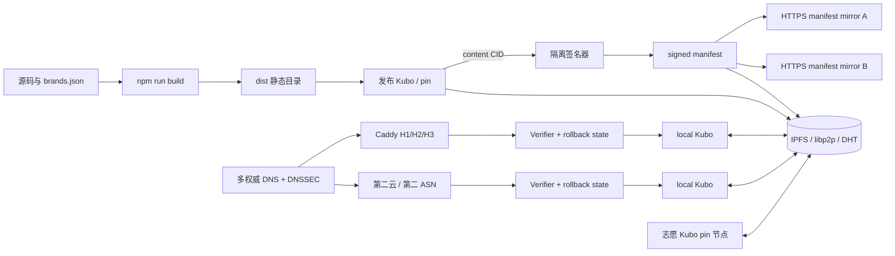

# 弹性发布架构

## 目标

双休购是 Vite 静态站点。每次构建产生 `dist/`，发布工具将目录加入 Kubo 得到不可变内容 CID，再用发布者 Ed25519 私钥签发 manifest。受控入口与志愿镜像只传播公开内容，不持有发布私钥。



## 信任边界

| 组件 | 是否可信 | 持有秘密 | 能做什么 |
|---|---|---|---|
| 构建环境 | 有限信任 | 无发布密钥 | 生成 `dist`，可能产出恶意内容，签名前需审阅 CID |
| 发布签名器 | 高信任 | Ed25519 私钥 | 授权一个 CID 成为新版本 |
| 受控边缘 | 普通浏览器信任 | TLS 私钥、发布公钥 | TLS、限流、只代理已验证 CID |
| 志愿节点 | 不可信 | 仅自身 libp2p 身份 | 存储、传播或拒绝内容；不能伪造发布签名 |
| 本地客户端/Gateway | 用户信任 | 固定发布公钥、最高序列状态 | 验签、防回滚、让 Kubo 校验内容块 |
| DNS 提供商 | 便利入口信任 | DNS 管理权限 | 返回入口地址；不决定哪个 CID 是官方版本 |

重要限制：普通浏览器直接打开一个不可信公共 Gateway 时，不会自行验证 UnixFS DAG。发布公钥成为真实性根，只在实际执行 manifest 验签并校验 CID 的本地客户端、扩展或受控 Gateway 上成立。

## Manifest v1

签名输入：

```text
"shuangxiugou-resilient-web-manifest:v1\n" || JCS_RFC8785(payload)
```

```json
{
  "payload": {
    "schema": "urn:shuangxiugou:manifest:v1",
    "siteId": "shuangxiugou",
    "sequence": 42,
    "issuedAt": "2026-09-19T12:00:00.000Z",
    "expiresAt": "2026-10-19T12:00:00.000Z",
    "content": {
      "cid": "bafy...",
      "entrypoint": "index.html"
    },
    "previous": "bafy...previous-manifest-cid",
    "retrieval": {
      "gateways": ["https://edge-a.example", "https://edge-b.example"]
    }
  },
  "signature": {
    "alg": "Ed25519",
    "keyId": "sha256:...",
    "value": "base64url-signature"
  }
}
```

验证规则：拒绝未知字段、非规范时间、不安全路径、生产 HTTP Gateway、过期 manifest、低于本地最高序列的版本，以及同序列不同摘要的分叉。`previous` 用于审计版本链，但真正的回滚保护来自持久化最高序列、有效期和多来源比较。

## 故障恢复矩阵

| 场景 | 普通浏览器 | 本地客户端/Gateway | 设计控制 |
|---|---|---|---|
| 一个 DNS 权威失败 | 通常可恢复 | 可恢复 | 两个权威 DNS，健康检查 |
| DNS 返回伪造地址 | TLS/DNSSEC 可使其失败 | 可绕过传统 DNS | DNSSEC、多 DoH/DoT、缓存入口 |
| 所有 DNS 路径失效 | 无法仅凭域名恢复 | 可以 | 固定公钥、缓存 manifest/CID、IPFS discovery |
| 单入口 TCP reset | 可能换 IP/H3 | 可主动竞速 | 跨云/ASN、IPv4/IPv6、UDP 443 |
| UDP 443 被阻断 | 回落 H2/H1 | 回落 | 同时开放 TCP/UDP 443 |
| 发布源站离线 | 受控边缘仍在即可 | 可以 | 至少三个受控 pin + 志愿副本 |
| 恶意志愿节点 | 只经受控边缘较安全 | 可验证 | manifest 签名 + Kubo CID 校验 |
| 返回旧 manifest | 依赖边缘正确运行 | 已见高版本后拒绝 | sequence、expiry、持久状态 |
| 发布密钥泄露 | 无法仅靠当前 v1 恢复 | 无法仅靠当前 v1 恢复 | 后续离线 root、keyset epoch、透明日志 |

## 网络与 TLS

- 域名至少配置两个受控边缘、不同云与 ASN，并真实验证 IPv4/IPv6；
- 权威 DNS 多供应商时，DNSSEC 应使用双方明确支持的 multi-signer 方案；
- Caddy 同时监听 TCP 443 和 UDP 443，保留 HTTP/1.1、HTTP/2、HTTP/3；
- 每个受控边缘独立签发 TLS 证书，不把 wildcard 私钥交给志愿者；
- Kubo RPC `5001` 只绑定 loopback/容器私网，公网只开放 P2P `4001/tcp` 与 `4001/udp`；
- verifier 不接受访客指定 CID，只代理当前已验签 manifest 固定的 CID。

## 后续动态 API

静态 UI、数据快照和 JS 继续使用 CID 发布。投票、投稿、帐号等动态写入应独立部署：OIDC/Passkey、幂等键、速率限制、审核队列和跨区域数据库复制。动态响应不能仅靠 CID 解决身份与一致性问题；需要领域签名对象或透明日志时另行定义协议。个人信息和未公开投稿不得进入公开 IPFS。
